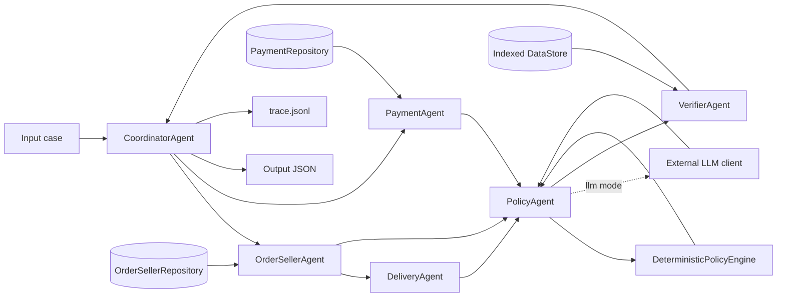

# Multi-Agent Architecture

## Overview

This repository uses a layered multi-agent pipeline for the Olist e-commerce dispute task. The agents are implemented in one deployable entry point, `resolve_disputes.py`, but data access, investigation, policy evaluation, LLM communication, verification and orchestration have separate class boundaries. Agents communicate through versioned handoff contracts recorded in the trace.

- `rules`: offline deterministic policy execution.
- `llm`: an external OpenAI-compatible LLM provides a policy classification. `DeterministicPolicyEngine` independently evaluates the same evidence and acts as the safety authority; disagreement or provider failure falls back to that grounded result.

## Component Flow



## Agents

| Agent | Responsibility | Data access | Handoff |
| --- | --- | --- | --- |
| CoordinatorAgent | Validates each case, invokes agents and writes final output | Input JSON and order-existence check | Routes versioned contracts; does not make policy decisions |
| OrderSellerAgent | Loads order status, items, sellers, item total and freight total | `OrderSellerRepository` only | `order_context.v1` |
| PaymentAgent | Reconciles payment rows and payment total | `PaymentRepository` only | `payment_context.v1` |
| DeliveryAgent | Compares carrier handoff, shipping limit, customer delivery and estimated delivery | Order and item handoff from OrderSellerAgent | Late delivery flags and seller handoff flags |
| PolicyAgent | Arbitrates the deterministic result and optional LLM classification | Domain handoffs only; no CSV access | `policy_decision.v1` |
| DeterministicPolicyEngine | Evaluates `EC_POLICY_V1` in strict priority order | Pure in-memory handoffs; no I/O | Grounded policy decision |
| VerifierAgent | Builds schema, caps lists, validates confidence, mappings, totals, refund and evidence existence | Handoffs plus read-only indexed data | `verified_output.v1` |

## Access Boundaries

`DataStore` loads and indexes CSV files once. Domain agents do not receive the full store:

- `OrderSellerRepository` exposes only order and item lookup.
- `PaymentRepository` exposes only payment lookup.
- `DeliveryAgent`, `PolicyAgent` and `DeterministicPolicyEngine` consume handoffs and cannot query CSV files.
- `VerifierAgent` receives read-only indexed data because it must independently prove that emitted entities and evidence IDs exist.

This limits accidental cross-domain coupling and makes each agent replaceable without changing the output contract.

## Handoff Contracts

| Contract | Producer | Consumer | Required content |
| --- | --- | --- | --- |
| `order_context.v1` | OrderSellerAgent | DeliveryAgent, PolicyAgent | Order status, items, sellers, item and freight totals |
| `payment_context.v1` | PaymentAgent | PolicyAgent | Payment rows, count and total |
| `delivery_context.v1` | DeliveryAgent | PolicyAgent | Delivery timestamps, late flags and violating items |
| `policy_decision.v1` | PolicyAgent | VerifierAgent | Issue, cause, parties, refund, actions and confidence |
| `verified_output.v1` | VerifierAgent | CoordinatorAgent | Schema-valid, evidence-grounded final output |

Each trace record contains a `run_id`, per-case `sequence`, sender, recipients and contract version. This makes the complete decision path reproducible without exposing the API key or full prompts.

## Handoff Flow

1. `CoordinatorAgent` reads `input/EC_*.json` and extracts `customer_request.claimed_order_id`.
2. `OrderSellerAgent` retrieves order, item and seller context.
3. `PaymentAgent` retrieves all payment rows and totals `payment_value`.
4. `DeliveryAgent` checks whether the order was delivered after the estimated date and whether carrier handoff happened after item `shipping_limit_date`.
5. `DeterministicPolicyEngine` applies the business rules in README priority order. In `llm` mode, `PolicyAgent` also sends a compact evidence package to the external model and only accepts a `primary_issue` from the allowed policy set:
   - `canceled_order_paid`
   - `unavailable_order_paid`
   - `late_delivery_seller`
   - `late_delivery_logistics`
   - `valid_split_payment`
   - `unsupported_late_claim`
6. `VerifierAgent` creates the final schema, then checks every emitted evidence ID against the indexed CSV data and independently verifies cause, action, totals and refund.
7. The coordinator writes one output JSON per input case and records each handoff event in `trace.jsonl`.

## Reliability Model

In `llm` mode, retryable HTTP failures are retried with bounded backoff. If a provider rejects JSON mode, the client retries once without `response_format`. Malformed responses, unsupported labels and decisions that conflict with deterministic evidence are recorded in the trace and fall back to the rule result, so one provider failure does not abort the 50-case batch.

Before the run is accepted, the verifier and final batch audit enforce:

- one output for every input and no unexpected `EC_*.json` file;
- valid policy issue, cause, action and refund mappings;
- monetary totals recalculated from CSV rows using `Decimal`;
- evidence format, list limits and evidence existence;
- consistent `case_status` and refund amount.

## Evidence Policy

The verifier only emits evidence IDs derivable from provided data:

- `order:<order_id>`
- `item:<order_id>:<order_item_id>`
- `payment:<order_id>:<payment_sequential>`
- `seller:<seller_id>`
- `policy:<root_cause_code>`

Entity sets and evidence are capped according to the README limits.

## Runtime

Run the pipeline with:

```bash
python resolve_disputes.py
```

To use an external LLM, create `.env` from `.env.example` and run:

```bash
python resolve_disputes.py --mode llm
```

The external provider must expose an OpenAI-compatible `POST /chat/completions` endpoint. The default configured model in source code is `qwen/qwen-2.5-7b-instruct`, which satisfies the lab limit of models up to 10B parameters.

The run creates:

- `output/EC_001.json` through `output/EC_050.json`
- `trace.jsonl`
- `metadata.json`

For LLM runs, `metadata.json` also records request, retry, success and failure counts.

For convenience, `trace.jsonl` and `metadata.json` are also mirrored into `logging/`.
